# ReadMe - Project 4 (HRTy)

** **

## Description

This project was undertaken in the final week of the course at the end of the introduction to Python, PostgreSQL & Django module. The back-end made use of these technologies while the front end was written in React with Sass/CSS styling and deployed using Heroku.

HRTy (HR Technology) was initially created by myself within the Salesforce platform during COVID 2020 in order to track employee furlough as we found our existing HR platform was unable to perform this functionality. Over time, we developed it as an information security tool to track employee logins as well as somewhere to log employee-lent business assets such as laptops, monitors etc to help the People Operations team with the new hybrid way of working.

## [Deployment link](https://hrtyhr-4d765332eef7.herokuapp.com/)

## Getting Started/Code Installation

1. [GitHub Repo](https://github.com/philiphart1006/hrty) >> 
2. Download directory >>
3. Server side:
    1. npm install in root directory
    2. npm run serve
4. Client side (Cd to client directory)
    3. npm install 
    4. npm run dev
5. Open local host in local browser

## Timeframe & Working Team

This project was undertaken solo over the course of 7 working days. Owing to unforeseen circumstances, these days were split over the course of Thursday 11th January - Tuesday 23rd January.

## Technologies Used

### Front End

* Vite
* Axios
* Sass (Chakra UI)
* JavaScript (React, React-Router-Dom)

### Back End

* PostgreSQL (hosted on Neon)
* Django
* Django Rest Framework
* JSON Web Token (jwt.io)
* psycopg2-binary

### Planning & resources

* Figma
* Trello
* Google Forms & Zapier
* DALL-E
* ChatGPT for seed data

## Brief

### “Technical Requirements

* Build a full-stack application by making your own backend and your own front-end
* Use a Python Django API using Django REST Framework to serve your data from a Postgres database
* Consume your API with a separate front-end built with React
* Be a complete product which most likely means multiple relationships and CRUD functionality for at least a couple of models
* Complex Functionality like integrating a 3rd party API or using a particularly complex React Component would mean that the CRUD and multiple relationships requirement can be relaxed, speak to your instructor if you think this could be you.
* Implement thoughtful user stories/wireframes that are significant enough to help you know which features are core MVP and which you can cut
* Have a visually impressive design to kick your portfolio up a notch and have something to wow future clients & employers. ALLOW time for this.
* Be deployed online so it's publicly accessible.”

## Planning

### ERD

Salesforce is also a relational database and so the ERD would look fairly similar. Whereas in Salesforce, I had join objects such as a _login _between employee & _software _to show active/inactive logins, for the scope of this product, I simply stuck to many-to-many relationships here.

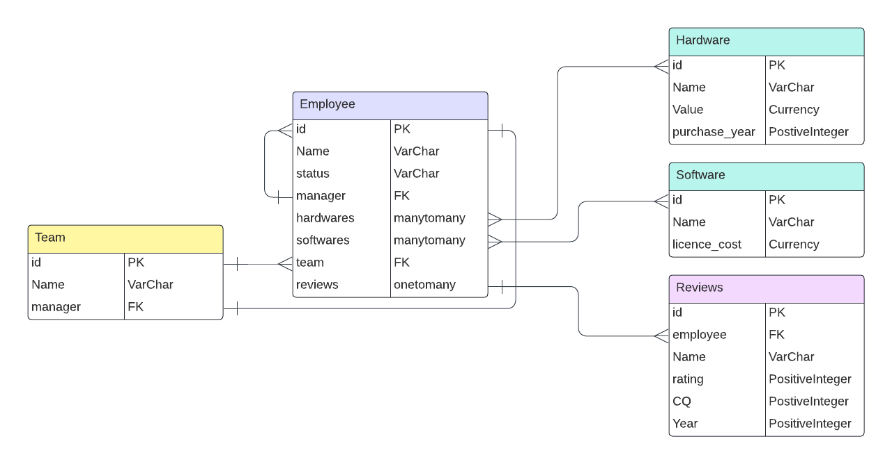

### Project management {#project-management}

Once again using a template Trello board, I split the application functionality and coding into separate _user stories_. User stories were split into front and back end build requirements. This helped to pseudocode & split out functionality into different components.

I also included columns for bugs & enhancements. 

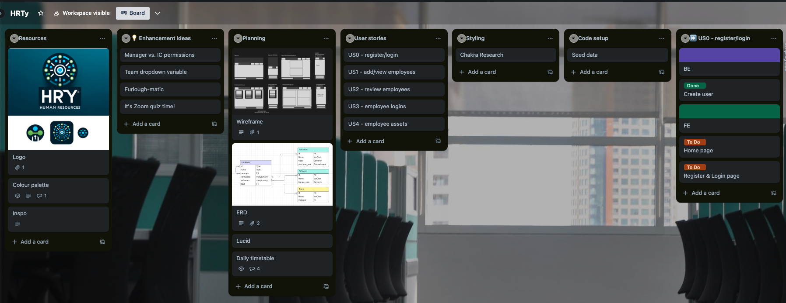

### Design

#### Wireframe

I utilised Figma here to draw out the wireframes with all HTML elements. Grouping elements, I was able to map out the pages with their relevant paths, components, loaders, and/or actions.

For this project, I really wanted to focus on it being mobile responsive so included this requirement in my initial wireframe designs.

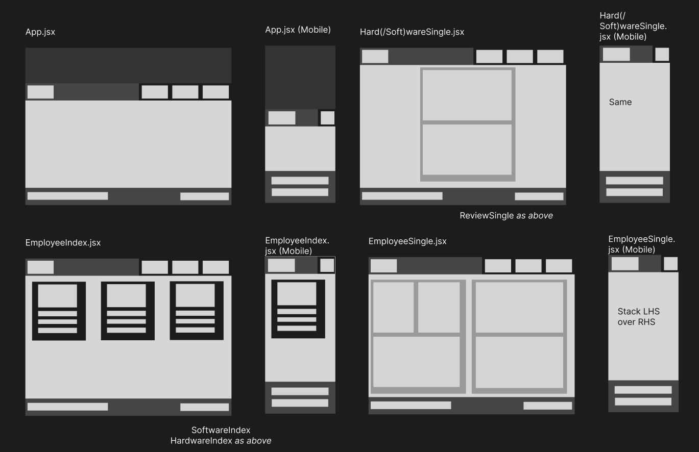

## Build/Code Process

#### Day 1 (Thursday 11th)

* Brainstorming/planning as above

#### Day 2 (Monday 15th)

* BE (Back End): Installed Django to establish the base backend folder structure including the initial project
    * Setup initial serializers, urls, and views for the API endpoints
* Replicated my ERD by installing multiple apps (reviews, softwares, teams)
* FE (Front End): Established front end folder hierarchy using Vite
    * Added placeholder React components for MVP pages outlined in wireframe

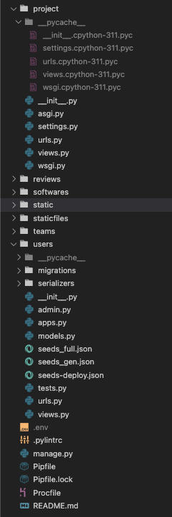

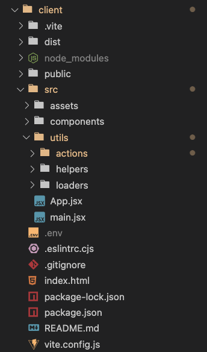

#### Day 3 (Tuesday 16th)

* BE: Tested & updated the API endpoints using Insomnia
* FE: added employee index (see “Wins - Employee Index page”), employee single page, & register/login

#### Day 4 (Wednesday 17th)

* FE: added login page, delete employee, & started employee edit page

#### Day 5 (Thursday 18th)

* FE: Fixed edit page (see “Wins - Employee Edit page”)
* BE: Added new app for Hardwares

#### Day 6 (Friday 19th)

* FE: ability to filter & add reviews on the review index page
* FE: Initial styling
* Deployment via Heroku
    * Built the front end using Vite
    * Transferred .env variables to Heroku configuration

#### Day 7 (Tuesday 23rd)

* FE: finalised styling
    * Chakra components for a responsive menu
    * Mobile responsive styling
    * Auth (register/login) forms
* Recording a Loom to demo my deployed project to my General Assembly cohort ([Loom 1](https://www.loom.com/share/3c34616cb2c543f789500fb5b49828e9) | [Loom 2](https://www.loom.com/share/825d2fdf1c0248f28da5b2d32753e777))

## Wins

#### Employee Single Page - showing many relationships 

In order to show not only employee object details, but those of the employee’s related manager, team, softwares, & hardwares, it was necessary to use a heavily populated serializer. This was an important consideration that had to be implemented on the back end so it was available in the employee single view:

1. Populated User Serializer

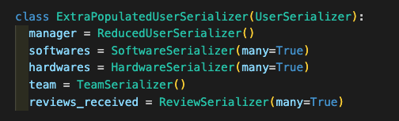

2. Utilising this serializer when extending Django’s own  retrieve, update, destroy view

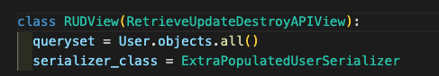

3. Attaching this view to the appropriate URL path for a single employee record

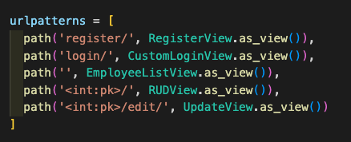

4. The result can be seen in Insomnia

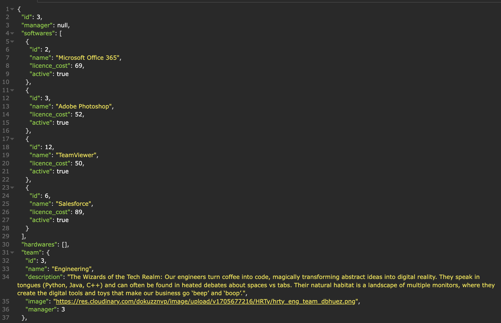

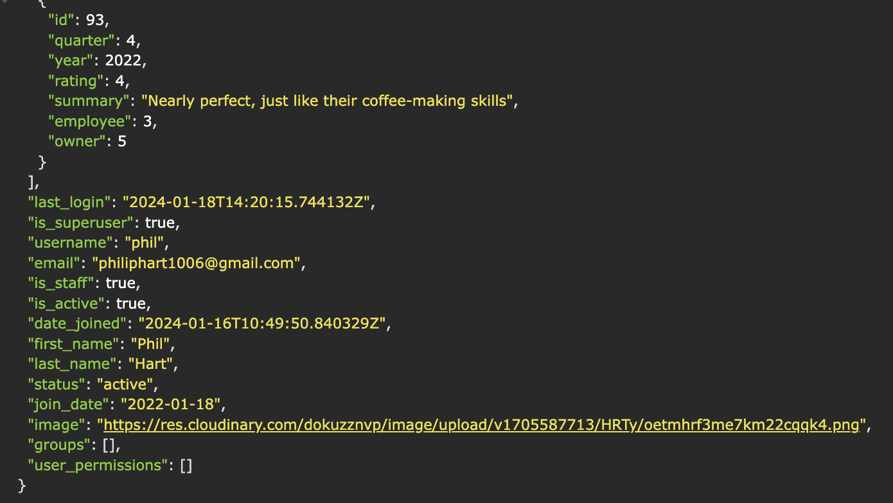

The final results for end users:

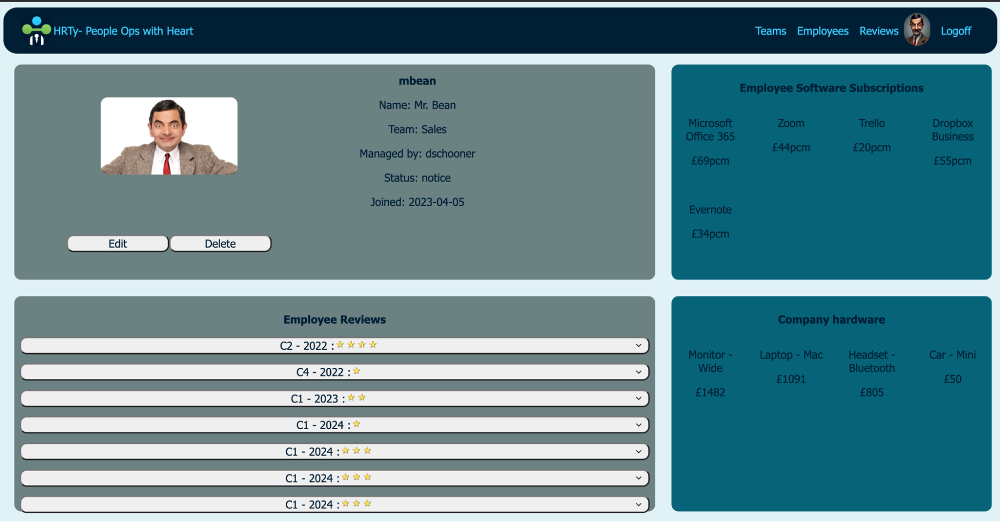

#### Employee Edit Page - editing many relationships {#employee-edit-page-editing-many-relationships}

On top of retrieving the information about the single employee as outlined above, in order to provide dropdowns & multi-select options to the end user to allow related objects to be changed/added/removed, it was necessary to make multiple API calls when loading the edit employee component:

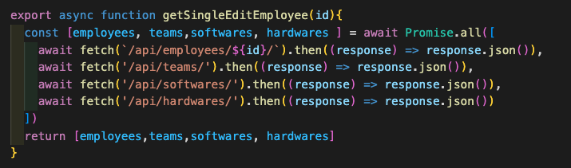

This meant that within the Team & Manager dropdowns, users could view & select by (user)name rather than IDs of the related objects. They would also update as more available softwares/hardwares were added.

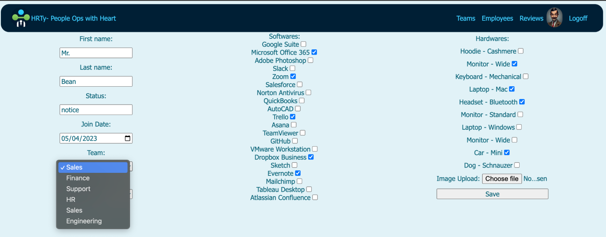

When updating many-to-many relationships such as softwares, it was important to update the array of related softwares when an option was checked/un-checked.

1. All available softwares were displayed as checkboxes that were pre-checked if that software ID featured in the employee’s related softwares already:

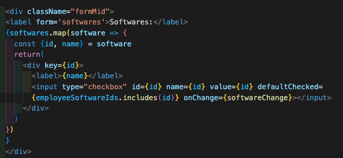

2. When a checkbox’s value was changed, the softwareChange function would add/remove that software’s ID from the employee’s softwares array which was currently saved to state in the formData:

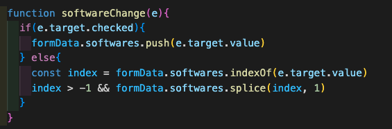

3. On submission of the form, the formData state object would be sent as a patch request to the API

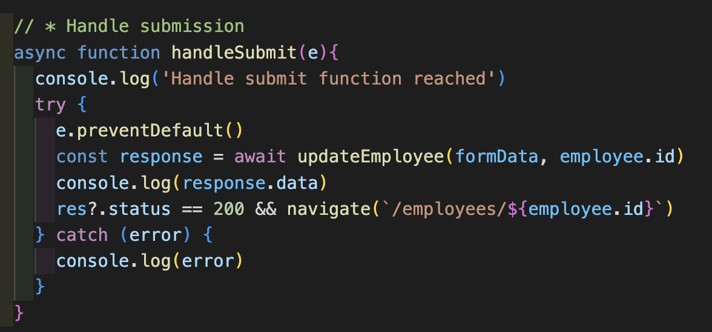

## Challenges

#### Loading times

When switching between different React components and executing various loader/action functions, the loading times are noticeable slow (over 5 seconds at times). This is a combination of a number of factors:

1. Using a free PostgreSQL hosting service Neon
2. Populated serializers that bring in information from multiple related objects
3. Loading all data from an object on the index pages

While, in reality, I would endeavour to find a good value paid hosting service that offered better loading times, there are another couple of mitigating steps that I have taken/could take to improve this:

1. When populating serializers with information from related users, I could use a “Reduced” serializer that only shows the related fields that will be useful.
    1. E.g. For an employee’s (User) related manager (User), only show a limited number of five fields for the related manager.

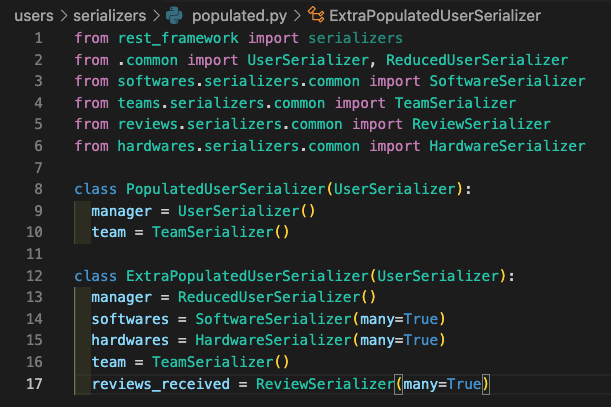

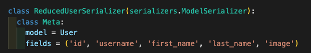

2. When creating list/index views, if I didn’t need all records in an object, instead of objects.all() I could have objects.select_related() or objects.pre-fetch_related() to reduce the number of calls to the API.

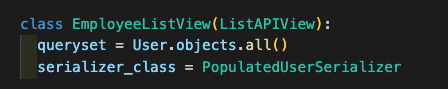

#### Saving logged in user information

In both my previous project (Software Seller) and this, when the user logged in and saved the login token to local storage, I also saved additional user information to local storage such as image which allows me to display the user’s profile image & a logoff link in the header.

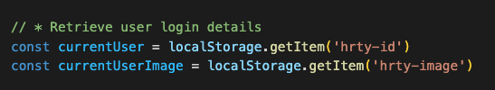

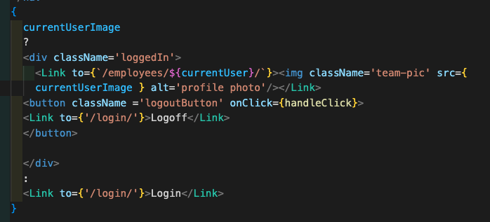

However, in my previous project, I set the current user’s username to state meaning this was displayed as soon as the user logged in. Within this project, the user would have to refresh the page before the currentUserImage`variable was updated.

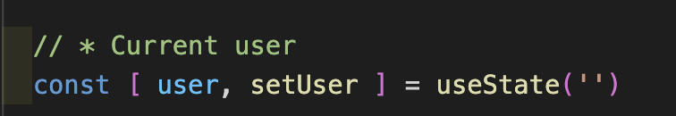

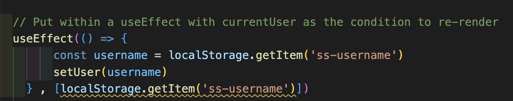

Saving these variables to local storage required them to each be removed individually when logging out (execution of the removeToken function shown below):

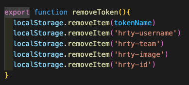

## Bugs

#### Unresolved bugs

While most were resolved before final presentation, a couple persist. The primary one I would look at resolving is the redirect on editing an employee.

I have two redirects currently:

1. Within EmployeeEdit.jsx, a _navigate _at the end of the handleSubmit function for the form when a 200 status is returned:

2. A redirect within the executed updateEmployee function within utils>>actions>>auth.js

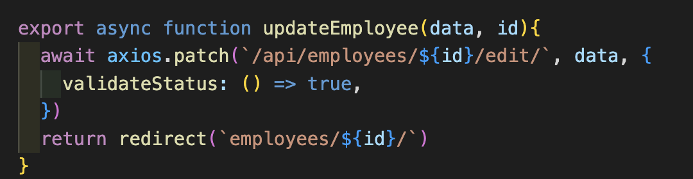

However, on submission of the form and a successful patch request, the page is not redirected.

#### New bugs

_User reported bugs will appear via [this form](https://forms.gle/EP5ibfGSWhsc5UFTA)_. This is implanted in the footer of the application to allow users to report bugs. Zapier automation would add a new card with these details to the user-reported bugs Trello list.

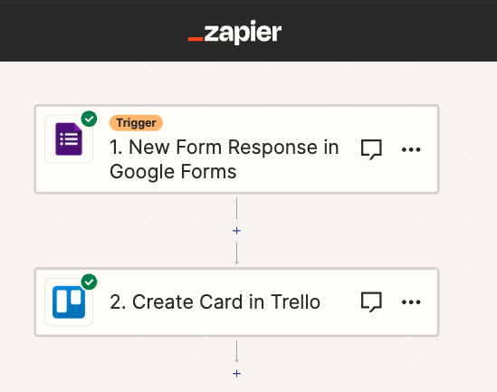

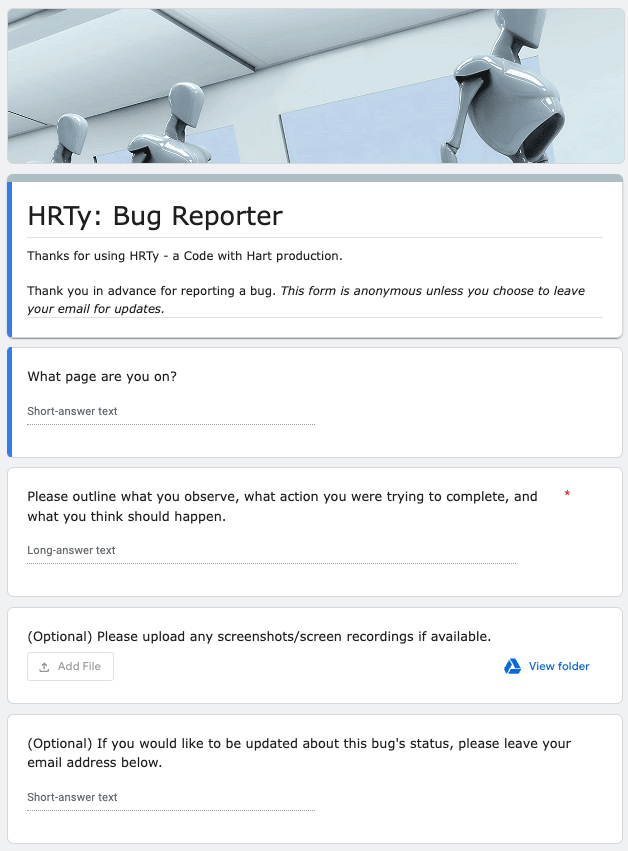

## Future Improvements

#### Remaining desired enhancements

##### Authentication

* Currently, I’m making use of the Django Rest Framework permission class “IsAuthenticatedOrReadOnly” and a custom “IsSelfOrReadOnly” permission that extends the default BasePermission class. Ideally, I would like to tailor permissions such that:
    * Only the HR team or super admin can make adjustments to employees
    * Only the Operations team can make changes to softwares/hardwares
    * Only the employee’s manager can create a performance review

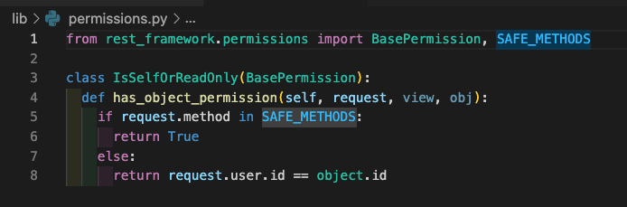

##### Join objects

* The ERD below outlines how I could replace the Employee&lt;->Software many-to-many relationship with a bridge object - _Login - _that would enable HRTy to track more accurately who has both _active _and _inactive _logins. This could be expanded to licence types, permissions etc.

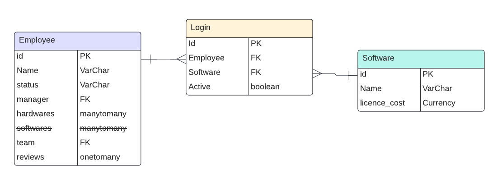

